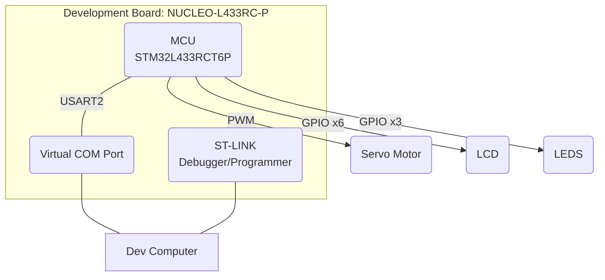

# Servo Motor Control Project

## Table of Contents
1. [Project Purpose](#ProjectPurpose)
2. [Hardware Configuration](#HardwareConfiguration)
3. [Features](#Features)
    - 3.1. [Version 0.2.0](#Version0.2.0)
    - 3.2. [ToDo](#ToDo)
4. [Project Photos](#ProjectPhotos)
    - 4.1. [Photos from Version 0.2.0](#PhotosFromVersion0.2.0)
    
## Project Purpose 
This project serves these purposes:
1. To revise control concepts (i.e. PID) and practice implementing them on an MCU.
2. To act as a showcase/demonstration of my current coding style/choices.

## Hardware Configuration 

### Hardware Diagram

## Features 

### Version 0.2.0 
- This version contains these key features:
    - The servo motor shaft position (angle in degrees) oscillates between (-90..+90) degrees.
    - The position and operational mode are displayed on the LCD.
    - The position and operational mode are transmitted to the virtual COM port.
    - LEDs indicate when the operational mode is "idle" (green), "motor running" (yellow), or "error state: firmware fault" (red & yellow).

### ToDo 

- **Motor Controller**
    - Close the loop to receive feedback from the servo motor by soldering a connection to the motor's potentiometer wiper
- **User Interface**
	- Add the ability for a user to input motor angles and other commands via the LCD (add pushbuttons to the hardware setup) and the virtual COM port
	- Add status/telemetry that is broadcast to the LCD and virtual COM port such as actual vs. expected angle, velocity, acceleration, etc.
- **Firmware**
	- Convert servo/LCD/LED drivers to object-oriented and generic, move them to a common repository so that I can use them across multiple projects with a varying number of those devices.

## Project Photos 

### Photos from Version 0.2.0 

